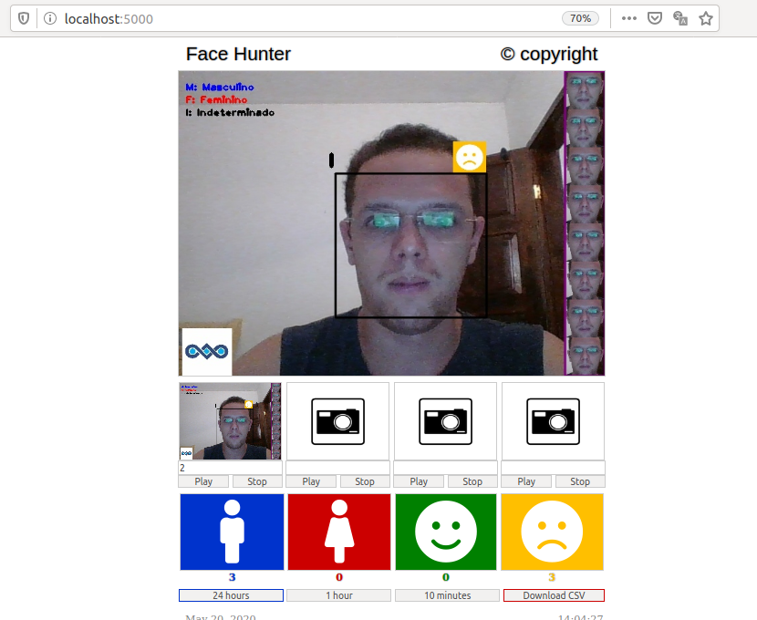

# Face Hunter Python Server: Smart Surveillance System

> **Authors:** 
> [Ronnyldo Silva](https://www.linkedin.com/in/ronnyldo-silva-200325145/), 
> [Eanes Pereira](https://www.linkedin.com/in/eanes-pereira-987580111/)

## Requirements

1. Install Opencv: See how to install on `README_install_OpenCV.md`
2. Install Boost: `sudo apt-get install libboost-all-dev`
3. Install Flask: `sudo pip install Flask`
4. Install Flask-Python: `sudo apt install python-flask`

## How to run

1. Run the python script from the terminal as `python server.py`
2. Open up the browser on your system which is on the same network to see the streaming video.
3. Go to `http://localhost:5000/`

